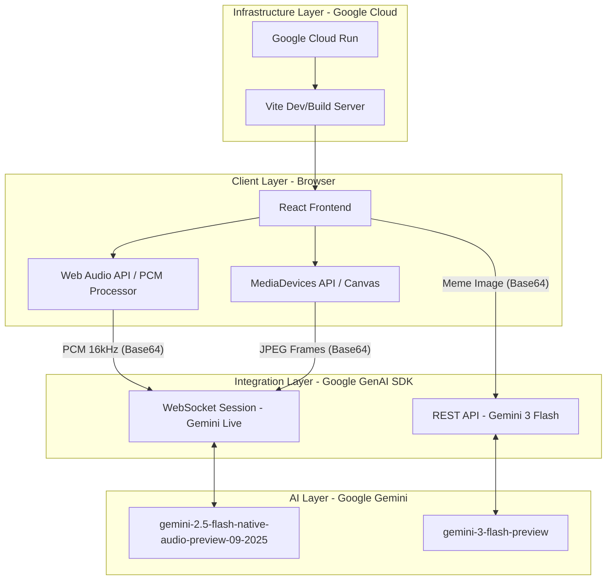

# ZLINGO Architecture

ZLINGO is a high-performance, real-time AI application designed to bridge the generational communication gap. This document details the technical architecture, data flow, and integration patterns used in the project.

## System Overview

The application follows a modern, serverless architecture deployed on **Google Cloud Run**. It utilizes a hybrid communication model: **WebSockets** for low-latency voice interaction and **REST/JSON** for multimodal analysis.

## Technical Components

### 1. Frontend (React + Vite)
- **Framework**: React 18 with TypeScript for type safety.
- **Styling**: Tailwind CSS for a "Vibe-First" aesthetic, utilizing glassmorphism and neon accents.
- **Animations**: `motion/react` (Framer Motion) for smooth transitions between "Coach" and "Decoder" states.
- **Icons**: `lucide-react` for a consistent, modern icon set.

### 2. Live Audio Engine (Web Audio API)
- **Capture**: Uses `navigator.mediaDevices.getUserMedia` to capture raw audio.
- **Processing**: A `ScriptProcessorNode` (or AudioWorklet) converts Float32 audio samples to **Int16 PCM** at 16,000Hz, as required by the Gemini Live API.
- **Playback**: Implements a **Scheduled Playback Queue**. Audio chunks received from Gemini (24,000Hz PCM) are scheduled using `audioContext.currentTime` to ensure gapless, glitch-free speech.

### 3. AI Agents (Google GenAI SDK)
- **Live Agent**: Establishes a persistent WebSocket connection to `gemini-2.5-flash-native-audio-preview-09-2025`. It handles real-time interruptions and provides low-latency voice feedback.
- **Multimodal Agent**: Uses `gemini-3-flash-preview` for high-speed analysis of meme images. It processes base64-encoded images and returns structured text explanations.

### 4. Contextual Handoff Logic
- The application maintains a `initialContext` state. When a meme is decoded, the resulting "lore" is passed as a `systemInstruction` override to the Live Coach. This allows the voice agent to "remember" the meme and initiate a relevant conversation.

### 5. Deployment (Google Cloud Run)
- **Containerization**: The app is containerized using Docker.
- **Hosting**: Deployed on Google Cloud Run, providing automatic scaling and HTTPS termination.
- **CI/CD**: Automated builds via AI Studio ensure that the latest "rizz" is always live.

## Data Flow

1.  **Meme Decoding**: User uploads image -> Frontend converts to Base64 -> Sent to Gemini 3 Flash -> AI returns lore explanation -> Explanation stored in React state.
2.  **Voice Coaching**: User clicks "Connect" -> AudioContext starts -> WebSocket opens to Gemini Live -> User speaks -> PCM data sent to Gemini -> Gemini responds with PCM audio -> Frontend schedules and plays audio.
3.  **Context Sync**: Lore from Step 1 is injected into the `systemInstruction` of Step 2, creating a unified AI experience.

## Security
- **API Key Management**: The Gemini API key is managed via server-side environment variables and injected into the frontend build process securely.
- **Permissions**: The app explicitly requests `camera` and `microphone` permissions via `metadata.json`.
