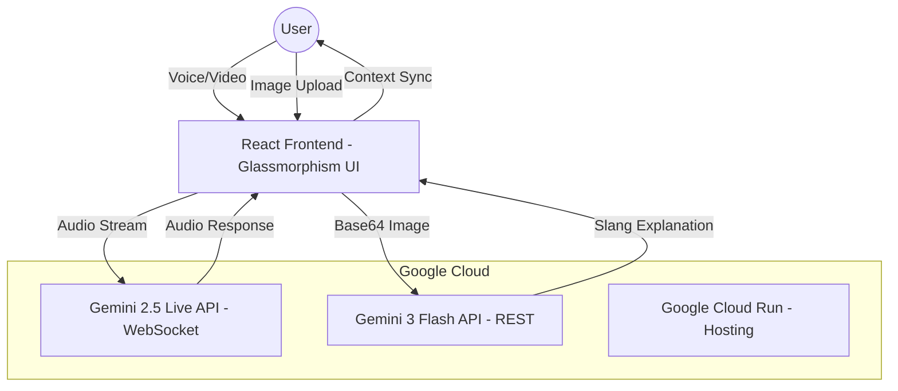

# Gemini Live Agent Challenge - Submission Details

## 1. Project Criteria Checklist

- [x] **Leverage a Gemini model**: Uses `gemini-2.5-flash-native-audio-preview-09-2025` for live voice and `gemini-3-flash-preview` for multimodal meme decoding.
- [x] **Built using Google GenAI SDK**: Implemented using the `@google/genai` library.
- [x] **Use at least one Google Cloud service**: Deployed on **Google Cloud Run**.

## 2. Project Summary

**ZLINGO** is an AI-powered cultural bridge designed to help users navigate the rapidly evolving landscape of GenZ communication. 

### Features & Functionality
- **Live Voice Coaching**: A low-latency voice agent that listens to the user and provides real-time feedback on their "rizz" (charisma) and slang usage.
- **Multimodal Meme Decoding**: An image-to-slang engine that breaks down complex internet lore into understandable terms.
- **Contextual Handoff**: The system maintains state between the visual decoder and the voice coach, allowing for a continuous learning loop.

### Technologies Used
- **Google GenAI SDK**: For low-latency WebSocket connections to Gemini Live.
- **React & Tailwind CSS**: For a modern, responsive "vibe-first" UI.
- **Google Cloud Run**: For serverless hosting and scalability.

### Findings & Learnings
Working with the Gemini Live API taught us the importance of **audio scheduling** and **latency management**. We implemented a custom playback queue to ensure gapless audio streaming. We also discovered that Gemini's multimodal reasoning is exceptionally good at identifying niche internet subcultures, which we leveraged for the Meme Decoder.

## 3. Architecture Diagram



## 4. Video Scripts

### Demonstration Video (4 Minutes)
- **0:00-0:30**: Intro - The "Cringe" Problem. Why GenZ slang is hard.
- **0:30-1:30**: Meme Decoder Demo. Upload a complex meme (e.g., Skibidi Toilet or a niche "aura" meme). Show the AI explaining it.
- **1:30-3:30**: Live Coach Demo. Click "Discuss with Z-Coach". Have a 2-minute conversation about the meme. Show the AI giving feedback on your slang.
- **3:30-4:00**: Conclusion - ZLINGO is the future of cultural education.

### Proof of Deployment Video (Short)
- Show the **Google Cloud Console**.
- Navigate to **Cloud Run**.
- Show the `zlingo` service running.
- Show the **Logs** tab with active requests.
- Show the **App URL** matching the deployment.

## 5. Bonus Points: automated Deployment

The project uses a `cloudbuild.yaml` (simulated via AI Studio Build) to automate the containerization and deployment process.

```yaml
steps:
  - name: 'gcr.io/cloud-builders/docker'
    args: ['build', '-t', 'gcr.io/$PROJECT_ID/zlingo', '.']
  - name: 'gcr.io/cloud-builders/docker'
    args: ['push', 'gcr.io/$PROJECT_ID/zlingo']
  - name: 'gcr.io/google.com/cloudsdktool/cloud-sdk'
    entrypoint: gcloud
    args:
      - 'run'
      - 'deploy'
      - 'zlingo'
      - '--image'
      - 'gcr.io/$PROJECT_ID/zlingo'
      - '--region'
      - 'europe-west2'
```
